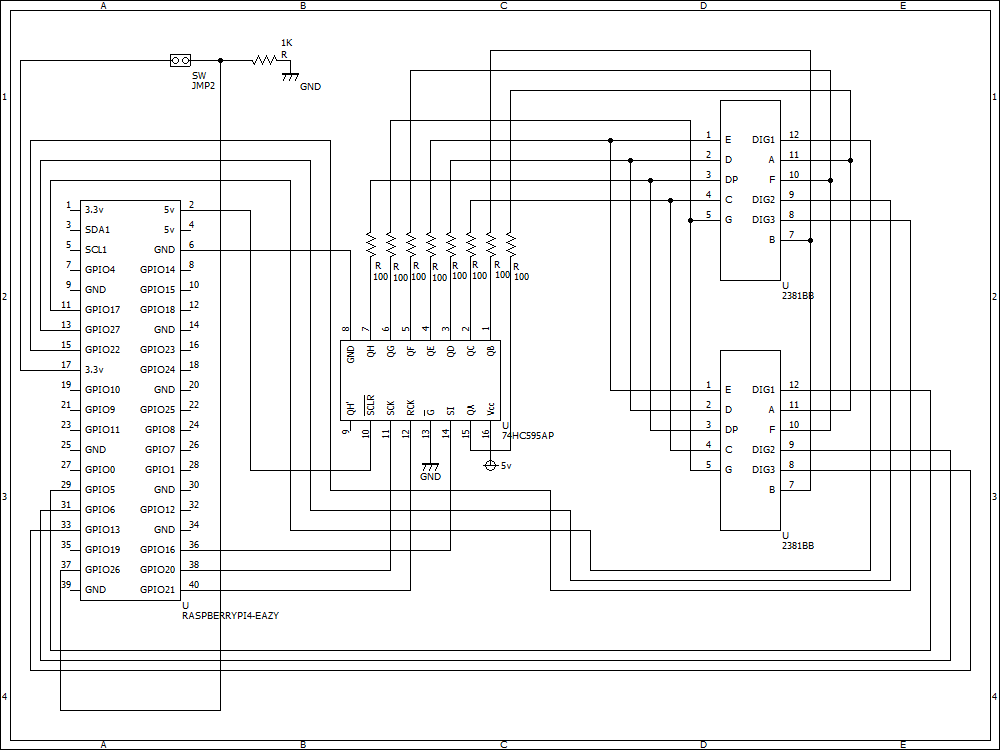

# Raspberry Piで作るTwitterのフォロー・フォロワーを表示するIoTデバイス

## 概要
twitterAPIを使って取得したフォロー数・フォロワー数や最新のツイートについたいいね数やリツイート数を7セグLEDに表示させます。

事前に各自TwitterAPIの __コンシューマーキー__ ・ __コンシューマーシークレット__ ・ __アクセストークン__ ・ __アクセストークンシークレット__ を発行しておく。

上記のキーを用いてTwitterOAuthでPHPからtwitterにログインし、情報を取得。

取得した情報をff.txtに書き込み。

書き込んだテキストファイルをc言語で記述した実行ファイルから呼び出して7セグに表示する。

一定時間ごとにPHPスクリプトを実行するシェルスクリプトで値を更新します。

## 使い方
1. PHPをインストール
2. apache2をインストール
3. gitclone
4. common.phpに各キーを入力
5. apache2のドキュメントルート以下にcloneしたファイルを移動
6. showff.cをコンパイル
7. updateff.shを実行
8. コンパイルしたshoff.cの実行ファイルを実行

※自動起動したい場合

crontab -eで@reboot showff @reboot updateff.sh等cronを使うなりやデーモンに登録するなりしてください。

## 用意するもの

* ラズベリーパイ本体

	※今回はRaspberryPi3 model Bを使用していますが、zeroや2,4等でも問題ありません

* twitterAPIの各キー

* 7セグメントLED 3桁2個

	※アノードコモン・カソードコモンどちらでも可。

	※私は３桁を使用していますが、４桁や３桁を２個以上組み合わせて表示したい桁数を選んでください。私はFFが少ないので３桁にしました。

* 74HC595 シフトレジスタ 1個

	※本来なら7セグ1個につき1個必要ですが、実装が面倒なので1個のみ使用しています。ちゃんとしたものを作りたいなら2個必要です。

* 7セグ用電流制限抵抗 カーボン抵抗7個

	※抵抗値は7セグの仕様によるので各自計算してください。

* プルダウン抵抗 カーボン抵抗1本 1Kオーム程度

	※プルダウンできれば良いので10Kでも100Kでも問題ないと思います。

* 単極単投モーメンタリースイッチ

	※FF表示/最新のツイートのリツイート数・いいね数を切り替えるスイッチです。

	※信号を送るだけなので何でもオッケーです。

* ブレッドボード・ジャンプワイヤー等

## 使用するソフト等
* php
* apache2
* wiringPi
* twitterAPI
* twitteroauth

## インストール&ダウンロード
* sudo apt install php
* sudo apt install apache2
* gitclone https://github.com/shizuka-iot/show_ff_by_twitter_api.git
* gcc -o showff showff.c -lwiringPi

## 回路図に沿って配線してください

